# Grafikk og design i «Aasen: Språkvandringa»

Dette dokumentet viser stilen i spillet og forklarer hvordan grafikken blir laget. Første del er retningslinjene vi følger når vi tegner noe nytt. Andre del forklarer de spesielle grepene vi har bygget: åsen med utsikten, kirkerommet, dørene, møblene, scenemotoren og resten.

Alt her bygger på stilguiden (`tools/pikselkunst/STILGUIDE.md`), arbeidsloggen (`tools/pikselkunst/ARBEIDSLOGG.md`, rundene 1 til 98), README for spillet (`js/rpg/README.md`), skillen for pikselkunst (`.claude/skills/pikselkunst/SKILL.md`) og koden i `js/rpg/`. Skjermbildene er tatt i spillet med Edge uten skjerm og viser lerretet på 320 × 192 spillpiksler forstørret tre ganger (960 × 576).

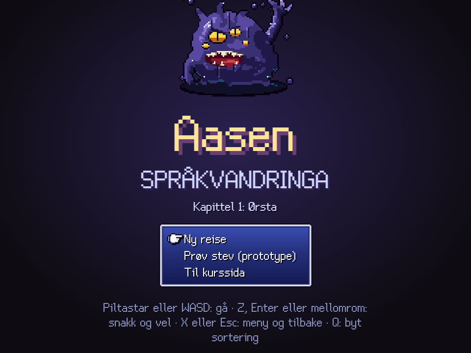

## Innledning: prototypen og forbildene

Spillet i `spel.html` er en prototype. Den har sitt eget lille scenario (Ørsta i 1826, den fremmede, haugbonden og Blekklatten) og fungerer som en prøvearena der grunnsystemene blir bygget og testet før den egentlige historien fra designdokumentet tas i bruk.

Målet er et 16-bits rollespill fra 90-tallet. Forbildene er særlig tre spill:

- **Final Fantasy VI** for portretter ved siden av teksten, mørkere og tettere tekstur, kampbakgrunner, figurer og gange, dører, senger og lyset (fargeregning som på Super Nintendo).
- **The Minish Cap** for lysere farger, store, runde tretopper, stier og objekter sett fra en høy vinkel.
- **Octopath Traveler** for dybde: det som ligger langt nede er uskarpt, disig og lysere, og svake lysstråler faller skrått gjennom disen.

I tillegg har klippene over Narshe i FF6 og toppen av pyramiden i A Link to the Past vært forbilder for høyden på Åsen. Målestokken for alt nytt er Blekklatten (`bilete/spel/blekklatten.png`, øverst på tittelskjermen). Alt nytt skal kunne stå ved siden av ham uten å skille seg ut.

---

# Del 1: Retningslinjer for grafikk

## Målestokk og størrelser

| Type | Størrelse i spillpiksler | Merknad |
| --- | --- | --- |
| Lerretet | 320 × 192 | skalert opp med hele tall |
| Flis | 16 × 16 | |
| Figur på kartet og i kamp | 16 × 24 | tegnet 12 piksler over flisen, så føttene står midt i nedre halvdel |
| Portrett i samtaleboksen | 48 × 48 | vist tre ganger så stort (144 × 144) |
| Vanlig fiende | 20 × 20 til 48 × 48 | |
| Boss | opptil 96 × 80 | Blekklatten er 80 × 72, kyrkjegrimen 80 × 68 |

Én spillpiksel er én piksel i PNG-filen. Vi skalerer aldri opp i selve filen. Hus, trær, møbler og altertavler er hele figurer, ikke gjentatte fliser.

## Arbeidsflyten: kilder, skript, sjekk og runder

Grafikken blir laget i en fast sløyfe: skriv kilden, lag bildet, se på det, vurder det mot stilguiden og forbedre. Normalt trengs to til fire omganger før et bilde er godt nok.

- **Kilden er alltid en `.pix`-fil** i `tools/pikselkunst/kjelder/`, et rutenett med en palett. Små bilder skrives for hånd. Større bilder lages av et lite Python-skript som tegner flater med spenn og punkter: `portrett.py`, `figur.py`, `bygg.py` (hus), `inventar.py` (møbler og kirkeinventar), `natur.py`, `eldstad.py`, `glod.py`, `utsikt.py`, `bakgrunn.py`, `grim.py` og flere. Flatene tegnes for hånd. Skygge regnet ut med kuleformler gir blass og støyete grafikk, og det var den viktigste lærdommen fra runde 1.
- **`pix.py lag`** lager PNG-en, en forstørret forhåndsvisning i 8x og et samhengsbilde i spillstørrelse. **`pix.py sjekk`** varsler om for mange farger, ensomme piksler og hull i omrisset.
- **Spillet sjekkes** med `node tools/sjekk-spel.js` (kart, dører, scener) og testsidene i `tools/`. Til slutt tas et skjermbilde med `skjermbilete.py` der grafikken er i bruk.
- **Større løft skjer i runder.** Hver runde starter med research (skjermbilder fra FF6 og Minish Cap, frie bilder fra Wikimedia Commons), finner det svakeste elementet, tegner det, sjekker det og skriver en oppføring i arbeidsloggen med før- og etterbilder. Nye regler går inn i stilguiden. Det er gjort 98 runder så langt.

## Standardperspektivet fra FF6

Objekter (møbler, kister, benker, fonter, tønner, gjerder) sees fra en høy vinkel, som i Final Fantasy VI og The Minish Cap: toppflatene er store og tydelige, og forsidene er korte. Målt i FF6 (bordene i Figaro og sengen i Narshe):

| Objekt i FF6 | Toppflate | Forside | Bein eller sokkel |
| --- | --- | --- | --- |
| Bord, 3 fliser bredt | 13 | 5 | 4 |
| Seng | om lag 3/4 av høyden | 4 | 0 |

- **Regelen:** for et objekt med dybde én flis (16 piksler) skal toppflaten være 9 til 13 piksler og forsiden 4 til 6 piksler, altså om lag 2 til 2,5 ganger så mye toppflate som forside. Bein og sokkel er korte (2 til 4 piksler). Høye ting som skap, prekestol og altertavle kan ha lang forside, men toppflaten skal også synes der.
- **Runde ting** (fat, font, tønne, brønn): åpningen er en bred oval som er 2/5 til 1/2 så høy som den er bred.
- **Rekkverk:** håndlisten er en bred toppflate på 4 til 5 piksler, og balustrene er korte (5 til 6 piksler).
- **Unntak:** kirkebenkene har høy rygg sett bakfra (13 piksler), så de passer med folkene som sitter i dem.

Regelen kom i runde 56. I rundene etter ble stova, kistene, stabburet, prestegården, Ekset, kirkeinventaret, skigarden og steingarden tegnet om etter den.

## Portretter i FF6-stil

Portrettene er målt mot Final Fantasy VI Advance (Terra, Locke, Edgar, Celes, Relm) og ble tegnet om fra runde 60 til 85.

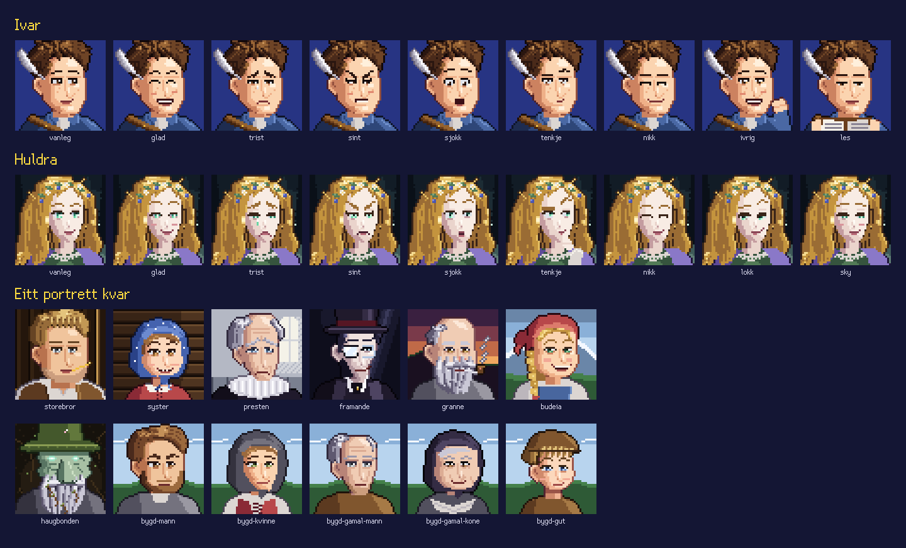

- **Utsnitt:** 48 × 48, tett utsnitt der hodet er om lag 28 piksler høyt, skuldrene er de nederste 8 til 10 radene, og håret kan gå ut over kanten. Vinkelen er tre kvart forfra. Lyset kommer forfra og ovenfra fra høyre, mot teksten.
- **Farger:** høyst 40 per portrett, fordelt på hud (6), hår (6), iris (4 til 5), øyehvitt (3), lepper (3) og klær.
- **Hud:** tre til fire toner i store, rolige flater: en stor lys flate mot lyset, en smal mellomtone og en jevn skyggeside mot øret og under kjeven. Ingen glanspunkter eller små lyse felt på kinn og nese, for i spillstørrelse bryter de opp ansiktet. Omrisset er farget (den mørkeste tonen i materialet), aldri svart, og på lyssiden spiser lyset litt av omrisset.
- **Hår:** klumper på 3 til 5 piksler, hver med mørk kant mot naboen, grunntone og lys side mot lyset. Glansen ligger som korte striper samlet i en ring over issen. Håret bak hodet er ett steg mørkere, så ansiktet ligger foran en mørk hårramme.
- **Øyne:** tykk vippelinje, øyehvitt i to toner, iris 3 × 3 i tre toner og én hvit glanspiksel. Irisen skal synes i minst to rader, så ingen ser trøtte ut uten grunn. Unge får store, runde øyne, gamle får poser og smilerynker. Øyenfargen varierer over hele galleriet (blå, grå, blågrå, brun, hasselbrun, grønn), og søsken kan dele farge.
- **Hodeform:** ingen deler omriss. Hver person får sin egen ansiktsform fra `kant()` i `portrett.py` (bredde, lengde, kjeve, hake, kinn). Kantete kjeve for storebror, rundt barneansikt for syster, langt og smalt for presten, tynt og innsunket for den fremmede, bredt og knudrete for haugbonden. Vi sammenligner silhuettene ved å tegne bare hudpikslene i én farge.
- **Kjennetegn:** hver person har sin egen silhuett og et kjennetegn (fjærpennen til Ivar, blomsterkransen til Huldra, flosshatten og brillene til den fremmede, pipekragen til presten, mosehatten til haugbonden), og en egen bakgrunn inne i ruten som passer personen. Aldri palettbytte av en felles grunnform. Småroller deler fem nøytrale fellesansikter.
- **Bare hovedpersonene har kjensleportretter.** Ivar og Huldra har glad, trist, sint, sjokk, tenkje og nikk, og i tillegg ivrig og les (Ivar) og lokk og sky (Huldra). Alle andre har ett portrett, og figuren på kartet viser kjensla. Som i FF6 er det brynene, øyelokkene og munnvikene som bærer uttrykket.

## Farger og lys i tegningen

- Hvert materiale har en skala på tre til fem toner. Skyggene drar mot dyp fiolett (`#1a1238`) og lyset mot varm hvit (`#fff1c4`). En skygge er aldri bare en mørkere versjon av samme farge.
- Omrisset er nesten svart (`#0a0514`), én piksel, rundt hele figuren. Inne i figuren skiller vi flater med den mørkeste tonen i skalaen.
- Lyset kommer alltid fra oppe til venstre på kartet. Flater, ikke glidende overganger (cel-skygge). Dithering bare på store flater og sparsomt, aldri i ansikter.
- Høyst 16 farger per flis, 24 per figur, 32 per fiende og 40 per portrett.
- Varme, lyse farger i lyset og kjølige, blågrønne i skyggen. Taket og bakken skal ha ulik farge, ellers glir huset inn i graset.
- Ting som står på bakken har slagskygge mot høyre og ned. Bakken selv har ikke omriss. Tekstur lages med klynger i fast mønster (tuster, klumper, stokker), ikke med tilfeldige enkeltpiksler.

## Lysmodellen etter FF6

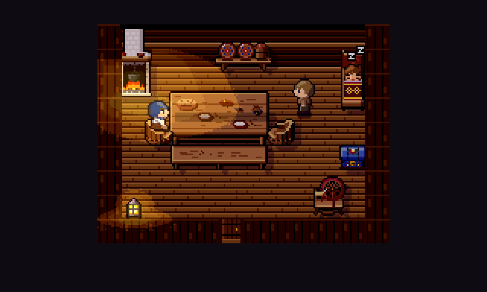

Lyset etterligner Super Nintendo og Final Fantasy VI. Det meste er tegnet inn i pikslene. Resten er fargeregning slik maskinvaren gjorde det:

- **Fargeregning:** etter at kartet er tegnet, regner `lys()` i `motor.js` om hver piksel med en fast farge som legges til, trekkes fra eller halveres (snitt), med klemming per kanal og 5 bit per kanal (15-bits farger). Det skjer med én `getImageData`, oppslagstabeller per bånd på 8 rader og én `putImageData`, om lag 1 ms per bilde. Ingen myke gradienter og ingen vignett.
- **Bakgrunn og figurer hver for seg:** en maske skiller figurene fra bakgrunnen, så rommet kan bli mørkt mens figurene holder fargene (som kommandoene $51 og $53 i FF6).
- **`STEMNINGAR`** i `data.js` beskriver lyset på hvert kart: `morgon` (varmt, varmest øverst, med hardkantede skyskygger som driver), `kveld` (fiolett), `inne`, `mork`, `stabbur`, `kyrkjerom`, `minne` og flere. En stemning er en rad i tabellen.
- **Handtegnet glød:** gløden rundt hver lyskilde er en egen form tegnet for hånd i `glod.py`, ikke en utregnet ellipse. Eldlys fra grua ligger lavt og bredt over gulvet og kaster en bue av lys opp på veggen. Et stearinlys har en smal og høy glød. Lykta har en rund glorie, en smal midje langs stolpen og en flat pøl på bakken. Lysekrona har små glorier ved lysene og en pøl på gulvet under. Hver form har to til tre trinn med harde kanter og noen få håndplasserte ditherpiksler i kanten.
- **Flimmer:** ilden og gløden har to eller tre rammer som byttes hvert 150. millisekund. Elden flimrer mer enn lys og lykter.
- **Lyspøler** på gulvet ligger fast der lyskilden henger eller står, også når selve lysekrona flytter seg med parallakse.

## Vann, stier og terreng

- **Vann som i FF6** (Lete-elva): vannet ligger lavere enn landet, med en skrent på 3 til 4 piksler (jord eller berg) under landet i nord, skumlinje og skyggestripe. Strandkanten er et glatt felt regnet over kartpikslene, så nes og viker fortsetter over flisgrensene og hjørnene blir runde av seg selv. Fire dempede grå-turkise toner i bånd som går på rundgang: vinkler som flyter nedover i en bekk, rolige bånd mot land i en sjø. Ingen glitter. Stryk har loddrette, lyse striper og skumkant nederst.
- **Stier som i The Minish Cap:** tråkket jord i gyllen oker med lav kontrast mot graset, myke, ovale søkk og noen lyse prikker. Kanten har soner: lyst, kort gras nærmest, så strå som lener seg inn over stien. Kanten er et glatt felt, så svingene blir runde og kryssene får små plasser. Hovedveier er to fliser brede, og alle dører har sti fram til seg.
- **Terreng:** skrent (`s`), rampe (`/`), stup (`M`), overheng (`U` rundt og `Z` spisst) og luft (`-`) er egne kartteikn som tegnes over kartpikslene, så kantene går over flisgrensene. Skogkanten langs kartkanten er tett og mørk innerst og lysere fremme, og den bukter seg inn og ut etter glatt støy. Aldri en rett rekke.
- **Element som skal henge sammen med naboene** (vann, steingard, sti, skogkant) lages i kode med en nabomaske, ikke som faste bilder.

## Norsk byggeskikk og referanser

Referansene til virkeligheten ligger i `tools/pikselkunst/konsept/`, med opphav og lisens i `konsept/KJELDER.md`. De er bilder med fri lisens fra Wikimedia Commons. Skjermbilder fra FF6 og Minish Cap ligger i `forhand/referansar/` og er ikke i git.

- **Torvtak:** solbleket olivengrønt og gult, med tuster og blomster, never ved takskjegget og vindskier som krysser over mønet. Taket dominerer huset (om lag tre fjerdedeler av høyden).
- **Laft:** liggende stokker med laftehoder på hjørnene og grunnmur av stein. Låven har stående bord. Stabburet står på steinstolper med luft under.
- **Inne:** bondestova med kalket grue, langbord, benker, kubbestoler og rokk. Embetsmannshjemmet (prestegården, Ekset) med mahogni, messing, kakkelovn og golvur.
- **Klær på Sunnmøre rundt 1800:** menn med rød topplue og hvit vadmålsjakke, kvinner med rød trøye, mørkt skjørt og hvitt skaut.
- **Kirken** er en hvit langkirke etter Vartdal kyrkje, og kirkerommet bygger på Kvernes, Grytten, Dale i Luster, Hove, Fåberg, Lygra og Nordfjordeid.

## Ekte forbilder

Noen ting er tegnet etter konkrete, ekte forbilder:

- **Ivar** er tegnet etter fotografiene av Ivar Aasen fra 1871, 1881 og 1884 (Carl Christian Wischmann), et fotografi uten årstall og bysten i bronse av Augusta Finne fra 1896, som en ung versjon av det ansiktet: langt og rektangulært, høy panne, bred, kantete kjeve og hake, lang og bred nese, lang overleppe, små, dype øyne under tunge øyelokk og store ører (runde 73 til 81).
- **Altertavla** er bondebarokk etter altertavla i Kvernes stavkirke fra 1695 og altertavla i Fåberg: to etasjer med vridde gullsøyler og akantusvinger, nattverden i predellaen, korsfestelsen i hovedfeltet og oppstandelsen øverst.
- **Kistene** er tegnet etter kister på Norsk Folkemuseum (1897 og 1930) og en rosemalt kiste fra Nasjonalbiblioteket: buelokk, brede jernbånd og kisten om lag dobbelt så bred som dyp.
- Ellers: grua etter stova fra Gulsvik på Norsk Folkemuseum, golvuret etter et Mora-ur fra 1834, kakkelovnen, skatollet, sofaen fra biedermeiertiden, skigarden på Norsk Folkemuseum og bautasteinene fra Hedlehaugen og Naustdal.

## Skildre i stedet for å animere

Det som er unødvendig kostbart å animere, kan teksten beskrive. En kort setning i manus («Det luktar mold, og noko trengjer seg opp mellom golvplankane») sammen med de enkle effektene som finnes fra før (blink, risting, toning, bytte til et nytt bilde, en pose) holder. Vi lager ikke egne rammeanimasjoner for engangshendelser, som når kyrkjegrimen stiger opp av gulvet. Animasjon er for det spilleren ser ofte: gange, sitting, ild, vann og kjensler.

## Skriften

Spillet har to egne pikselskrifter, tegnet for hånd glyf for glyf til dette spillet. Kildene er rutenett per glyf i `tools/skrift/spelskrift.txt` og `runeskrift.txt`, og `python tools/skrift/bygg.py` bygger `.woff2` og `.ttf` med fontTools (hver piksel blir et kvadrat på 128 enheter, 16 piksler per em).

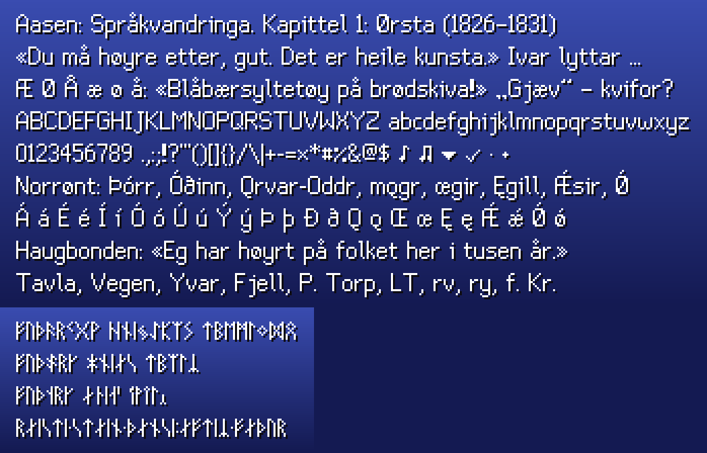

- **Spelskrift** har latinske bokstaver, tall og tegnsetting, Æ Ø Å, de norrøne Þ Ð Ǫ Œ Ę Ǽ Ǿ (store og små), vokaler med akutt og noen symboler. Store bokstaver er 9 piksler høye og små 6, med kerning.
- **Runeskrift** har hele runeblokka i Unicode: den eldre futharken, den yngre (langkvist og stuttkvist), punkterte runer og skilletegn.
- I manus blir `⟪ord⟫` et ord Ivar lærer (i gull), `⟨...⟩` norrøn tale i egen farge og `⟦...⟧` runer i rød oker, slik runesteinene var malt.
- Teksten er skarp: alt i vinduene måles i hele skjermpiksler, og et SVG-filter gjør hver piksel helt dekket eller åpen, med skygge én skriftpiksel nede til høyre.

## Styring bare med taster

Spillet styres bare med taster, som et konsollspill. Musen kan ikke peke, klikke eller rulle i noe på spillflaten, og musepekeren er skjult. Piltaster eller WASD for å gå og flytte pekeren, Z for å snakke og velge (holdt nede: springe), X for menyen og tilbake, og Q for å bytte sortering i Ordboka. Styrekorset på mobil ligger utenfor spillflaten og sender de samme trykkene som tastene. Nye UI-element skal aldri ha klikk, hover eller musehjul.

---

# Del 2: Spesielle ting vi har bygget

## Åsen som en ås

Kartet `asen` var opprinnelig flatt. Fra runde 25 til 58 ble det bygget om til en ås med høyde, etter klippene over Narshe i FF6 og toppen av pyramiden i A Link to the Past. Høyden leses av bakkekanter mellom nivåer, en høy bergvegg og et landskap langt nede som flytter seg saktere enn kartet.

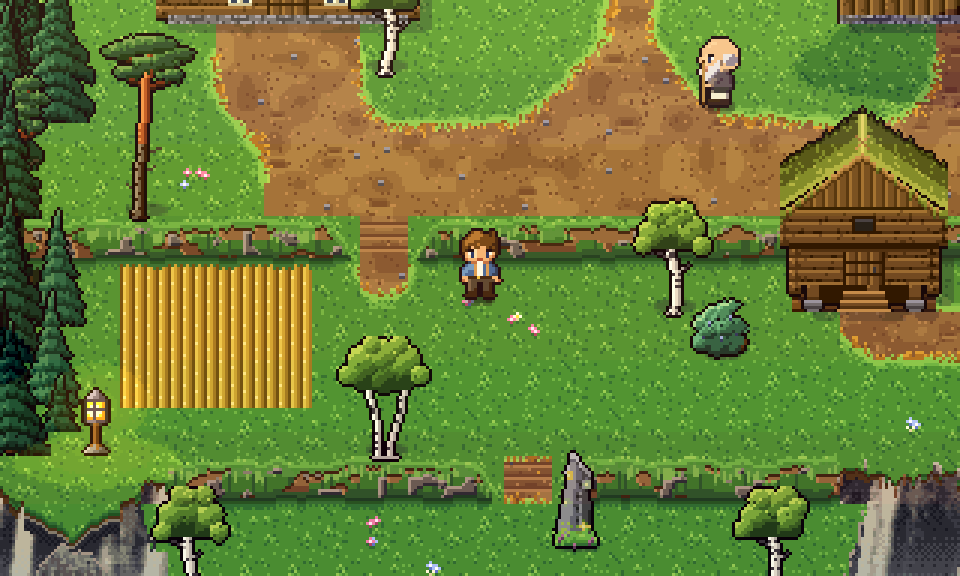

**Nivåene.** Kartet er delt i nivåer med skrenter (`s`): graskledde skråninger sett forfra med jord og bergnabber og slagskygge på graset under. Ramper (`/`) er en kleiv i skrenten der stien går ned med trinn. Toppen ligger høyest på midten (to koller med skog), og stien til utmarka går i søkket mellom dem. Tunet ligger på midtnivået, og bøen med åkeren og stabburet under en skrent til.

### Utsikten øverst: lag som stiger fram

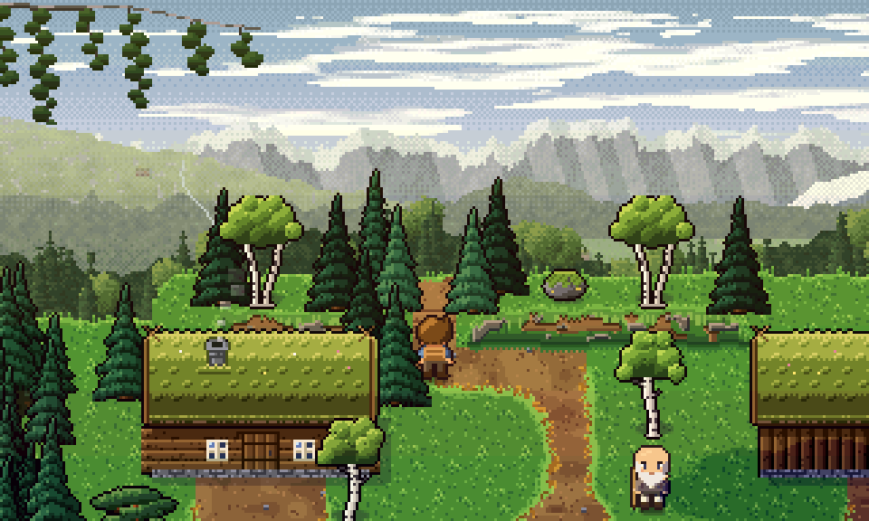

Når Ivar går opp mot toppen (rad 4 eller høyere), glir kameraet rolig seks rader opp over kanten, én piksel per tikk (`kameraOpp: { fra: 4, rader: 6, fart: 1 }`). Over kanten ligger fire bakgrunnslag med hver sin parallaksefaktor:

| Lag | Faktor | Innhold |
| --- | --- | --- |
| `himmel` | 0,04 | blå himmel, lysere mot horisonten, lange skyer med lys kant |
| `fjell` | 0,08 | disige, alpine topper med snø |
| `dal-nord` | 0,22 | lia opp mot utmarka og setra til venstre, Hovdebygda med kirken til høyre |
| `naer` | 0,45 | mørke trekroner i lia rett under kanten |

Fordi de fjerne lagene flytter seg minst, stiger landskapet sakte fram over horisonten mens kameraet glir opp, og trekronene nærmest synker bak kanten når kameraet går ned igjen. Dybden kommer av luftperspektiv malt inn i bildene: jo lenger borte, desto lysere, kaldere og mer disig, med færre farger og ingen svarte omriss. Kanten øverst (`N`) er graset som slutter i en ujevn, lys linje med strå mot himmelen, og den bøyer seg ned mot sidene der det er luft. Bjørkegreiner i forgrunnen (faktor 1,3) henger inn i de øvre hjørnene og går fort ut av bildet.

Lagenes posisjon rundes til hele piksler hver for seg, og de er en monoton funksjon av kameraet, så ingenting rister fram og tilbake. I lyset får pikslene der bakgrunnen synes sitt eget fjerne nivå, uten skyskygge og uten glød.

### Kanten nederst: neset, vika og hylla

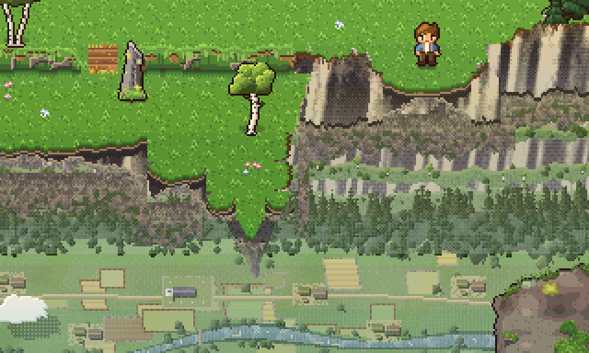

Nederst er kanten ujevn i selve kartet: platået stikker ut i et nes og går inn i en vik, og under midten går en skrent med rampe ned til en hylle ett nivå lenger nede før det stuper. Hylla smalner av fra fem til tre til én gangbar flis ytterst, så den henger som en grastunge ut over dalen.

- **Stupet** (`M`) er store, runde knauser som lener seg litt, med lys side mot venstre og dype, blåsvarte renner, som berget i Narshe. Kanten øverst er ujevn over flisgrensene: graset går ned i tunger, strå henger over, og røtter og steiner stikker ut. Det er aldri et firkantet hakk.
- **Overhenget** (`U`) er der bakken stikker lengst ut: graset henger over i en rund bue, en tynn kant av torv og berg har skygge under, og berget bak er trukket inn. Under spissen ytterst på hylla er det luft rett ned, og berget trekker seg inn under graset. `Z` er samme overheng med spiss form, til variasjon.
- **Sidene** på hylla mot stupet er skrå og ujevne, bredere nederst.
- **Ura:** bunnen av bergveggene er åpen og ujevn, og under fortsetter det i en ur av stein i samme farger, med kratt og einer, som glir ned i lia. Veggen og dalsiden møtes uten skjøt.

### Dalbildet: fra dalside til ovenfra

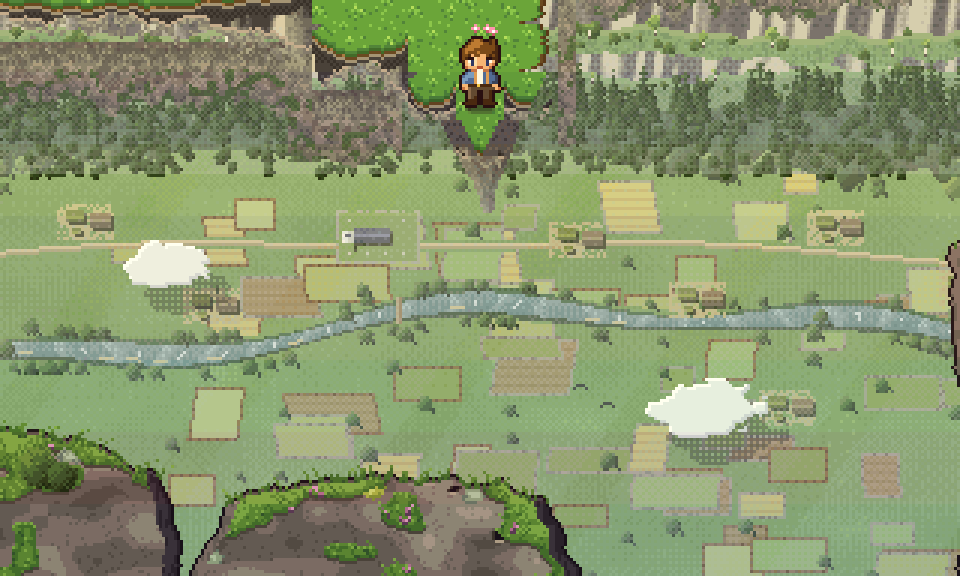

Under stupet ligger `li`, et fast lag med faktor 1 som følger kartet. Vi prøvde først parallakse også her, men en flate langt nede skulle ha glidd mye saktere enn lia og gled feil, så laget ble gjort fast (runde 32). Øverst ser vi ned langs dalsiden skrått forfra: bergvegger med grashyller som blir lavere og bredere nedover, og skog der granene først står som spisse silhuetter og så blir runde kroner sett ovenfra. De nederste kronene overlapper dalbildet, så perspektivet glir fra dalside til kart uten skjøt.

Lenger ned ser vi rett ned, som landskapet under pyramiden i A Link to the Past og verdenskartet i FF6: trær som runde, takkede klumper, teiger som fargefelt med steingarder og skigarder, elva som et bånd med mørk bredd og grusører, veien som en lys linje, gårdene som små torvtak og kirken som et skifertak med hvitt tårn. Alt er dempet og disig. Etter Octopath Traveler er skogen langt nede uskarp (pikslene doblet), og svake lysstråler faller skrått gjennom disen.

**Det som beveger seg:** skyene under oss er et eget lag som driver én piksel per 12 tikk og går rundt. Elva er et eget lag med fire rammer der lyse bånd og glimt flyter nedover. Tre små fugler svever langt nede (to rammer, driver sakte). Det finnes også en variant `dal` der lia er kortere og dalbunnen stiger fram nedenfra raskere enn kartet (faktor `[1, 1.8]`), men standard er det faste laget.

**Nabbene i forgrunnen.** Bergnabbene står i forgrunnen med faktor over 1, så de glir fortere enn kartet. De er tegnet skrått ovenfra, i samme perspektiv som kartet og dalen: toppflaten er den største flaten, med rolige steinflater, grasmatter langs kanten, lyng i klynger, lav i noen få flekker og lange sprekker. Sidene er bare et smalt bånd i skygge. Først var de tegnet nesten rett forfra med høye, loddrette forsider, og da ødela de perspektivet ned i dalen (runde 51). Berget går så langt ned at nabbene alltid står på noe, i alle kameraposisjoner. Graset på dem vaier i vinden i tre rammer.

**Kamerautløserne.** Langs det meste av kanten står kameraet stille. Bare på seks utløserruter (neset og ytterst på hylla) glir kameraet rolig fire rader ned, én piksel per tikk, så Ivar står øverst på skjermen og utsikten fyller resten (`kameraNed.ruter`). Kameraet gjelder også midt i steget mellom to utløserruter, så det ikke glir opp og ned når Ivar går langs neset. Glidingen går for seg selv i tikktakt, uavhengig av om Ivar går eller springer.

## Kirkerommet

Kirken ble utvidet i rundene 30 og 52 til 80. Den er nå 21 fliser bred, og det er 33 fliser fra døra til alterringen: om lag 6,6 sekunder å gå og 4,4 å springe. Lengden er valgt med vilje, så det tar tid å gå opp midtgangen. Det første forsøket var 50 fliser, og det ble for stort (runde 64). Gangtiden måles av testen `tools/sjekk-kyrkjegang.html`.

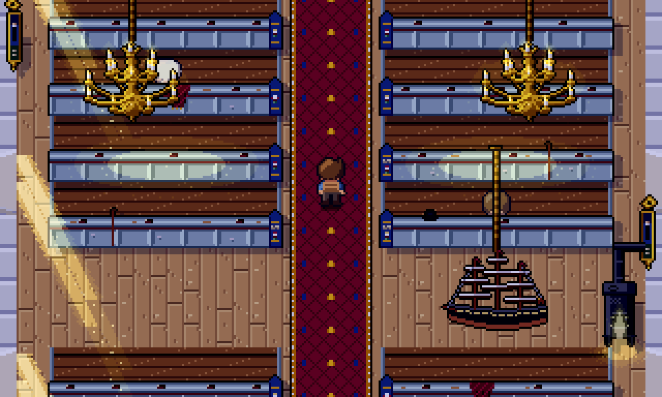

**Lysekroner med parallakse.** Lysekronene, votivskipet og bjelkene i tårnet er inventar som henger høyt (`over: true`) med en egen `faktor` over 1, så de flytter seg raskere enn gulvet når kameraet går. Kjettingen tegnes opp til et takpunkt med enda større faktor (`tak`), så den blir lengre øverst på skjermen og kortere nederst. Gløden følger krona, mens lyspølen på gulvet ligger fast der krona henger. Kronene henger i par over benkeblokkene, ikke over midtgangen, så kjettingen aldri går rett over Ivar.

**Mørk stemning med lysstråler.** Stemningen `kyrkjerom` gjør rommet mørkt, og som i de mørke interiørene i FF6 kommer lyset bare fra kildene: strålene fra vinduene, den egne glødformen `altar` over altertavla og altaret, alterlysene, lysekronene med pølene sine og lysestakene. Figurene er lysere enn rommet, så de er lette å lese. Strålene er parallellogrammer skrått ned i tre trinn, og støvkorn synker i dem (`stov: true`). Strålene og støvet klippes til fliser som er gulv i kartet (`golvVed`), så en stråle aldri går ut i det svarte utenfor veggen (runde 68).

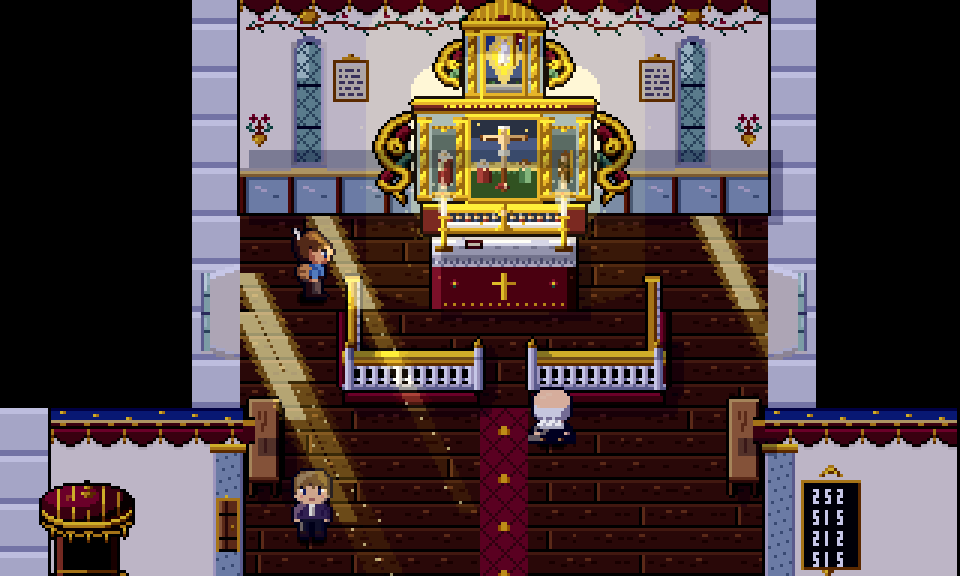

**Koret** har sitt eget gulv av mørke eikeplanker på tvers mot de lyse furuplankene på langs i skipet. Bakveggen er fem fliser høy med vinduer, rankeverk og draperi.

**Benkene som dekker figurer.** Kirkebenkene er sju fliser lange, lukket, med høy rygg sett bakfra (13 piksler) og benkedør med rose mot midtgangen. Gulvet inne i benken er et eget flatt lag under figurene, så radene kan stå tett uten gulv imellom. Den som går i benkeraden, senkes 5 piksler, så setet og ryggen foran dekker føttene. De som sitter, løftes 2 piksler, så hodet til den som står bak, synes over dem. Variantene (navneplate, hatt, sjal, stokk, slitasje, salmebøker) er satt rad for rad, så ingen rad er lik naboen.

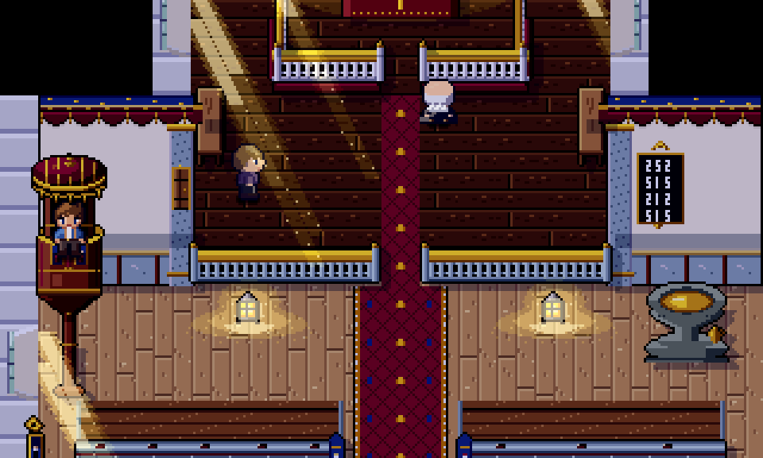

**Prekestolen med gangen gjennom veggen.** Prekestolen sitter på veggen, og inngangen går gjennom muren fra koret, gjennom en dør i pilasteren. Den er bygget i fire lag: laget bak (åpningen i veggen og bakre halvdel av korga), karmen, forsiden med bibelen og søylen, og lydhimlingen som henger over. Gangen inne i muren er fliser som ser ut som mur, men som man kan gå på (`Ĝ`). Kartet har en liste `skjult` med rutene der muren dekker figuren, og motoren klipper bort akkurat den delen av figuren som er over en skjult rute, piksel for piksel. Slik glir Ivar gradvis inn bak muren og pilasteren og ut igjen bak karmen, uten å forsvinne med ett og uten å synes som silhuett over den hvite veggen (runde 80). `hogd` og `lag` på kartet løfter ham og gir ham riktig plass i tegneordenen, så han står midt i korga med brystningen foran seg. Z mot bibelen gir en liten preken med svar fra kirkefolket.

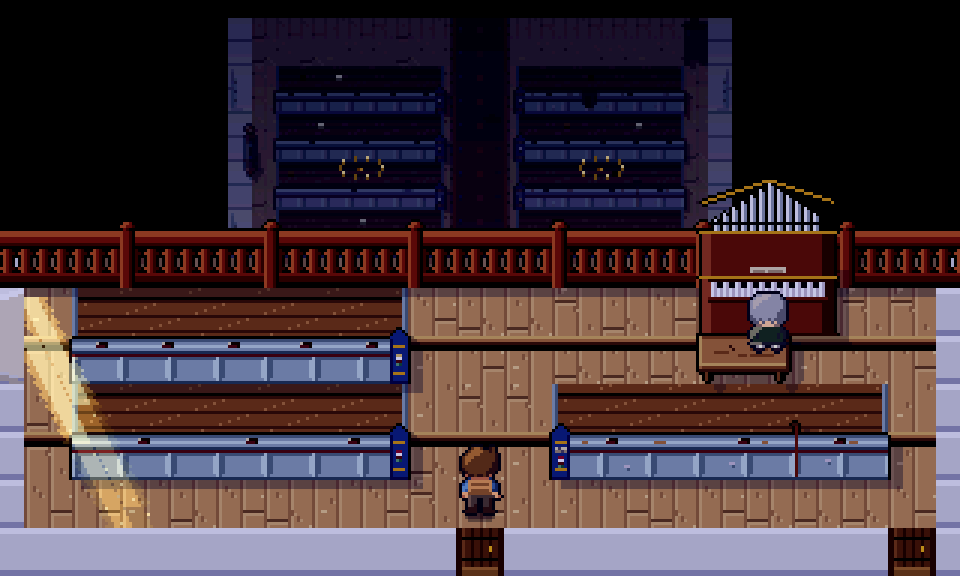

**Galleriet** nås via trappa i våpenhuset. Utsynet ned i skipet er et eget bilde laget av selve kirkekartet (`utsyn_galleri.py` med `oversikt.py`): skipet uten lys, uten folk og uten det som henger høyt, i halv størrelse, mørkt og dempet, med hoder i benkene og lysekronene sett ovenfra. Det ligger flatt med lav parallakse (faktor 0,75), så det leses som dypere enn galleriet. Brystningen er kraftig og mørk med dreide balustrer.

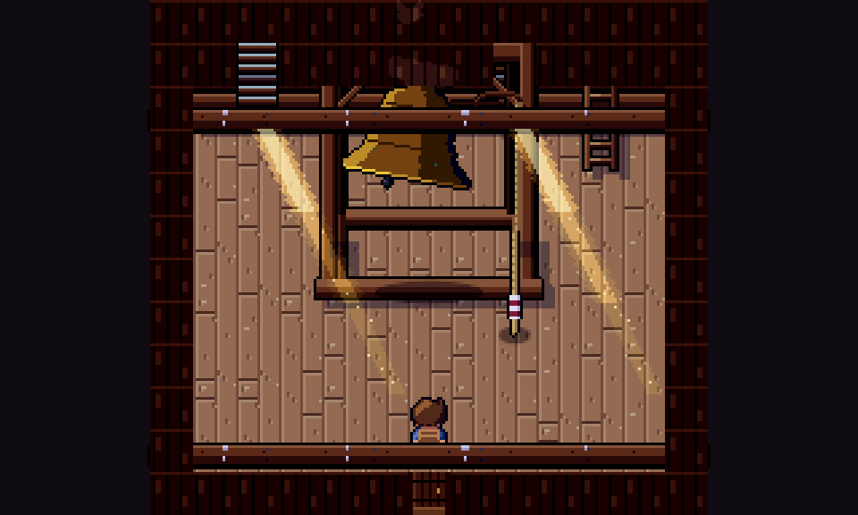

**Klokketårnet.** Klokka er et vesen med ni rammer (`klokke-0` til `klokke-8`, fem grader fra hverandre) laget av `klokke.py`, der hver piksel er regnet tilbake til klokka i hvile, så lyset følger med. Manus bytter mellom rammene med 45 til 85 ms mellomrom, så klokka svinger mykt ut til begge sider, slår med risting og «DONG» på ytterpunktene og dør ut. Kolven er en egen del som henger rett ned i verden og derfor henger etter klokka, til den slår mot kanten. Dua på bjelken flyr ut gjennom lydluka i sju flygerammer ved første slag og er tilbake neste gang Ivar kommer inn.

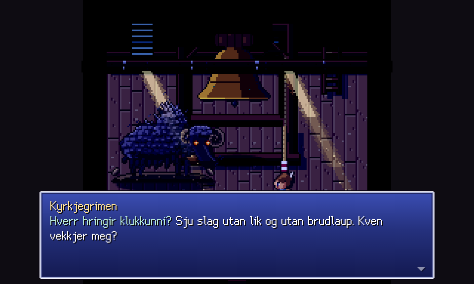

**Kyrkjegrimen** er løyndomskampen i tårnet (runde 98). Drar Ivar i klokketauet sju ganger i ett og samme besøket, slår klokka en åttende gang av seg selv, dua flakser ut i panikk, og lyset blir kaldt og mørkt (`tone` på bakgrunnen og figurene). Grimen, et svart værlam med glødende øyne som ble gravd ned levende under koret, trenger seg opp mellom gulvplankene og snakker norrønt. Her ble regelen om å skildre i stedet for å animere brukt: han dukker opp med blink og tekst, ikke steg for steg opp av gulvet. Sju drag i samme besøk og ikke totalt er valgt fordi det er en handling med vilje, så den som ringer litt hver gang, ikke snubler over ham.

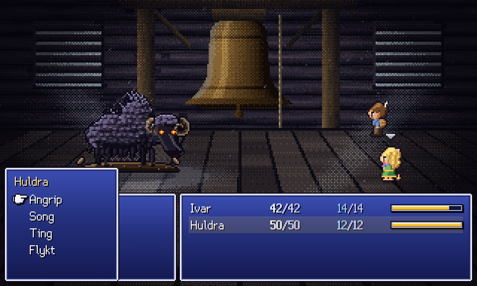

Grimen (80 × 68, 26 farger) har ull som krøllete klumper med egen cel-skygge og horn som spiraler. Kampbakgrunnen `klokketarn` er malt i `bakgrunn.py` med mørk laftevegg, lydluker med kaldt lys, klokkestolen og bronseklokka.

## Dører som i FF6

Dørene har to rammer, lukket og åpen, og ingen animasjon mellom dem, som i Final Fantasy VI (runde 96). Den åpne rammen er et helt bilde (`stove-open`, `kyrkje-open` og så videre, `ope=True` i `bygg.py` og `inventar.py`): mørkt inne, svakt lys ved dørstokken og dørbladet slått innover på kant i karmen.

- **Gjennom døra:** går Ivar mot en lukket dør han kan gå gjennom, bytter den straks til den åpne rammen, han går ett steg inn i åpningen, og skjermen toner over. På andre siden står døra han kom ut av, åpen et øyeblikk og lukker seg.
- **Kort trykk** (runde 97): et kort trykk mot en lukket dør (under 100 ms) åpner den uten at Ivar går gjennom. Den står åpen så lenge han står foran og ser mot den, og lukker seg 300 ms etter at han går bort eller snur seg. Det er med vilje ingen tidsgrense, for en dør som smeller igjen mens man ser på den, ville føles som at spillet tok kontrollen. Holder han tasten inne, går han gjennom.
- **Dører i scener:** en figur som går inn på eller ut av en dørrute, åpner døra av seg selv, og den lukker seg 300 ms etter siste steg. En figur som står i ro på en lukket dørrute, er fortsatt inne og blir ikke tegnet. Slik kan syster komme ut døra med skiftebrevet og gå inn igjen uten egne dørsteg i manus.
- **Trappevarianter:** dører til en annen etasje viser trinn som går opp eller ned i mørket i åpningen (`E:opp` og `E:ned`, `trapp` på døra). Trapper kan bare gås inn på fra bunnen og toppen, ett trinn per steg (`trapper` på kartet).

## Møbler

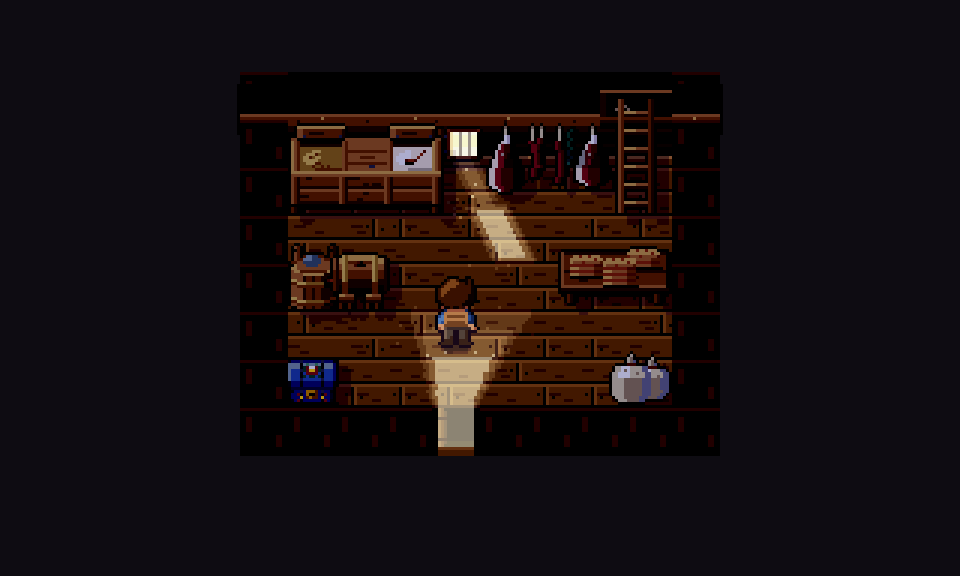

Hvert møbel er et eget bilde, så et rom kan settes sammen på flere måter. Bord, benker og kubbestoler følger standardperspektivet: bordplata er 26 piksler toppflate for to fliser dybde, benken 10 piksler toppflate og 5 piksler forkant og bein.

- **Sitteplasser** (runde 87 og 88): alt i `Pikslar.SETE` er en sitteplass spilleren kan gå inn på, og da setter han seg. Han sitter alltid i retningen til setet, aldri i retningen til siste tast. En benk uten rygg får retningen på tvers, mot bordet. Man kan ikke gå inn i eller ut av en stol over ryggen. Langs en benk glir han sittende til neste sete, med fire egne rammer for å flytte seg sidelengs. Overgangen er myk: han går helt inn på ruta, bytter til sitteposen i én ramme, og høyden glir opp på setet på tre tikk.
- **Sengen som i FF6** (runde 89 og 93): sengen står på langs inn fra bakveggen, som i Narshe og Kohlingen. Ivar går inn i sengen og legger seg under dyna. Hodet ligger på puta sett forfra med lukkede øyne (`sovehovud()` lager det av rammen der figuren ser ned), og lakenet og åkleet tegnes over kroppen opp til haka. Som på et vertshus i FF6 toner skjermen til svart og inn igjen.
- **Sortering rad for rad** (runde 92 og 95): store møbler inne deles i én stripe per flisrad, og hver stripe sorteres etter raden sin. En figur ved siden av sengen eller grua blir da bare dekket av den delen som er lenger nede enn føttene hans. Bakveggen er to fliser høy med en takbjelke øverst, så store møbler står foran veggen og ikke stikker opp over den.
- **Møbler i scenemotoren** (runde 90): scenestegene `sitje`, `liggje` og `reis` bruker samme mekanisme som spilleren, så Ivar kan våkne i sengen i åpningsscenen, og storebror kan sette seg på kubbestolen. Med `gaaDit` går figuren dit først.

## Scenemotoren

Alle hendelsene i prototypen bruker scenemotoren. En scene følger samme mal som manuset i designdokumentet: sted og tid, hvem som er med, og stegene. Stegene kan få figurer til å gå (`gaa`), snu seg, ta en pose (knele, sitte, peke, ligge, sove), sette seg, legge seg, komme inn og gå ut. Andre steg flytter kameraet, toner lyset, blinker i en farge, lager et spotlys, rister bildet, viser et nærbilde eller tar spillet over til et scenekart (et minne eller en drøm). Valg kan huskes, og Dagboka og fortellertråder skrives som steg.

**Kameraet overstyrer.** Mens en hendelse kjører eller kameraet går etter regi, står utsikten på Åsen (`kameraOpp` og `kameraNed`) i ro, og scenen styrer kameraet alene. Uten dette gled kameraet opp og parallaksen startet da kameraet fulgte syster fra døra i skiftebrevscena. Scener kan ikke hoppes over, så de skal være stramme.

## Bålplasser og lykter som lagringssteder

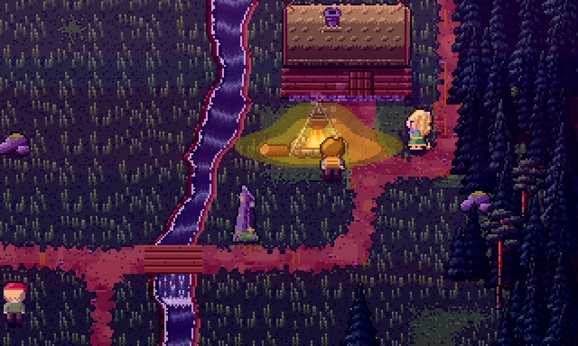

Partiet hviler og kan lagre ved en lykt eller en bålplass (runde 86 og 87).

- **Lykta** er én felles lykt for hele spillet, med jernkappe, glass med jernkors og flakkende veke i to rammer. Ute står den på en stolpe, inne står samme lykt på gulvet. Den passer i bygda, på gårdstun, inne i hus og i kirken.
- **Bålplassen** passer ute: i utmarka, i skogen, på setra og ved veien. Den er tre lag: bunnen (steinringen sett skrått ovenfra, oske og ved), flammene i fire handtegnede rammer, og forsiden (steinene foran og en kaffekjel), så forsiden dekker foten av flammene. Gnister og røyk tegnes i kode. Gløden har en stor, lav pøl over bakken og en glorie rundt flammene, men kjernen ligger bare i flammene, så steinene beholder fargene sine.
- **Bålet med gryte** er en større variant over to fliser, med en trefot av bjørkestenger uten omriss (lys never og mørk skyggeside, så den står tynt) og en gryte som henger over ilden og damper.
- Ved bålet setter Ivar seg på stokken. Stokken er en naturting med sete, så man også kan gå inn på den og sette seg.

## Brukergrensesnittet

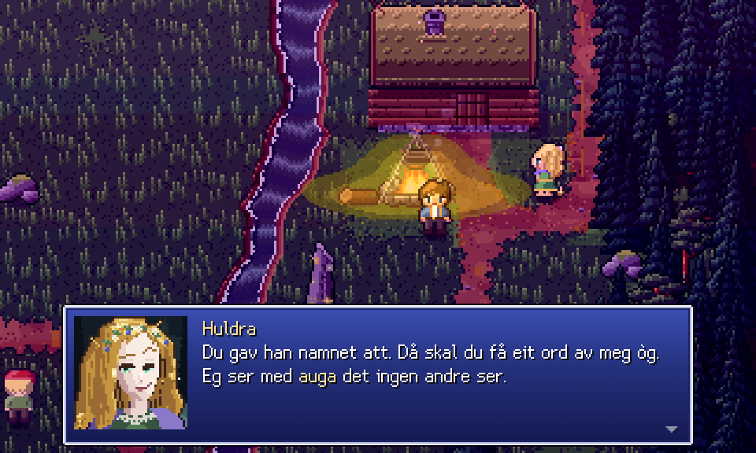

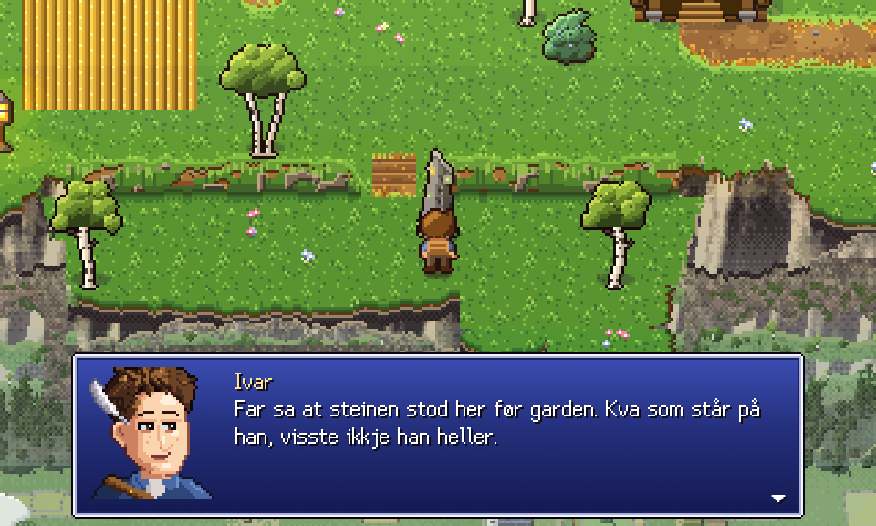

- **Fast samtaleboks:** boksen har fast størrelse, med navnelinjen og fire tekstlinjer, eller portrettet om det er høyere. Hele replikken legges ut fra starten, med tegnene som ikke er skrevet ennå, usynlige. Dermed brytes linjen på samme sted fra første til siste bokstav, og boksen endrer seg aldri. En replikk som trenger mer enn fire linjer, deles i sider. Vinduene har en egen pikselramme og en pekerhånd tegnet som `.pix`.
- **Faste kampvinduer:** alle vinduene i kampen har fast størrelse, som i FF6. Meldingen øverst er én linje, fiendene og partiet har plass til fem og fire, kommandoene står i et smalt vindu med fem rader, og listene (Galdr, Song, Ting, Stev) i et bredt vindu med to kolonner og fire rader og beskrivelsen på én fast linje.

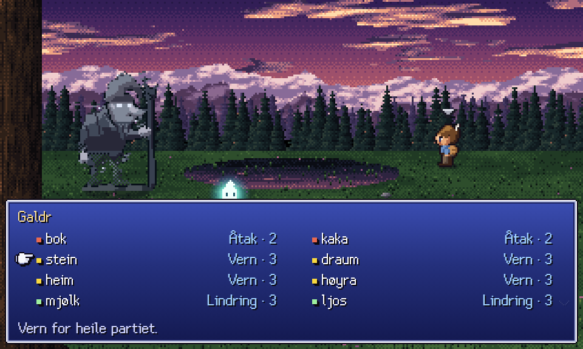

- **Rullelister:** `Motor.liste` tegner bare de radene som synes, så lista er like rask med 100 ord. Pekeren ruller lista ved kanten, ▲ og ▼ viser at det er mer, og lista går rundt fra første til siste.
- **Ordboka:** menyen har lister med detaljfelt. Ordboka viser ordene i to kolonner, sortert alfabetisk i nynorsk rekkefølge, i den rekkefølgen de ble lært eller etter lydfamilie (Q bytter). Ord Ivar ikke har sett på, er merket «ny». Detaljfeltet viser tyding, lydfamilie, former med hvem og hvor Ivar hørte dem, dansk, norrønt og galdren.

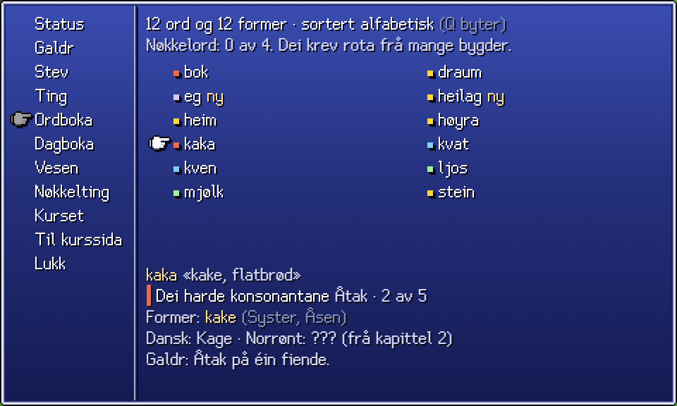

## Tikkbasert bevegelse og kamera mot hakking

All bevegelse går i tikk på 1/60 sekund, som på Super Nintendo, og alle farter er et helt antall tikk per flis. Spilleren går 12 tikk per flis og springer 8 (2 piksler per tikk), folk går 16 (1 piksel per tikk), og farter i scener rundes til 4, 8, 16, 32 eller 64 tikk. Da flytter figurene og kameraet seg like mange piksler i hvert bilde, og gangen blir jevn. Før gikk den fremmede 0,89 piksler per bilde, og bildet flyttet seg ujevnt.

Kameraet står alltid på hele piksler og følger etter med fast fart i hele piksler per tikk, ikke med en myk glidning. Med myk glidning mot noe som går, flyttet bildet seg ujevnt, og figurene ristet én piksel fram og tilbake mot bakken fordi fliser og figurer ble rundet hver for seg. Parallaksen rundes på samme måte, så heller ikke lagene rister.

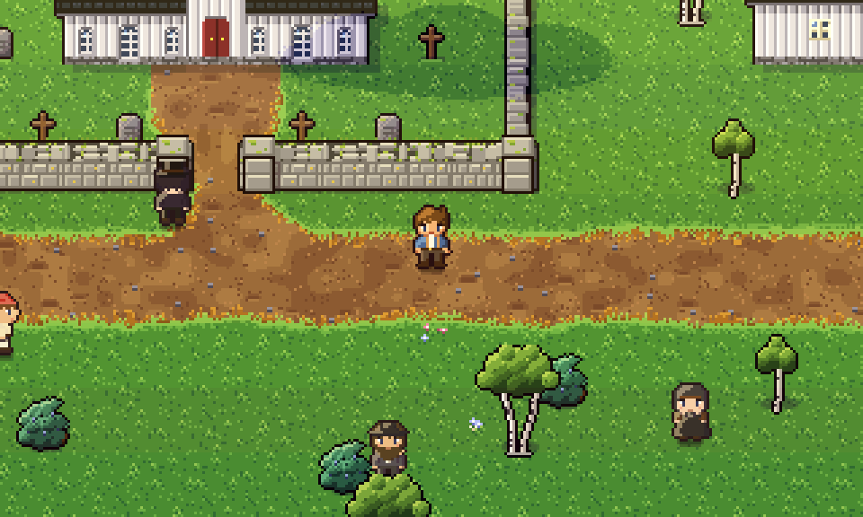

---

## Hva som står igjen

Fra «Står att» i arbeidsloggen, punkter som ikke er løst i senere runder:

- Kyrkjegrimen har ingen egen animasjon på kartet, og ulla kunne hatt lengre, tydeligere lokker i skyggesiden (runde 98).
- Dørbladet i den åpne rammen er smalt og synes lite på små dører, og Ivar er høyere enn døråpningen (runde 96).
- Ivar i kirkebenken synes bare med håret over ryggen (runde 87).
- Storebror og bygdemannen er begge brede og kantete med brunt hår, og fellesansiktene deler bakgrunn (runde 84).
- Utsynet fra galleriet er et fast bilde med malte hoder, og spillet har ingen lyd (runde 54 og 55).
- Flere kanttyper for kartkanten (lauvskog, berg, myr) (runde 35).
- Teigene i dalen er rette firkanter og kunne fulgt terrenget og elva mer (runde 34).
- Fjellene øverst på Åsen er én rekke med lik snø (runde 38).
- Strå langs stiene følger bare fire retninger, og søkkene ligger i et fast rutenett (runde 24).
- En sittepose på gulvet med beina i kryss (runde 18) og en animert variant av nærbildene (runde 17).
